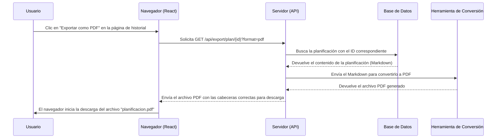

# Plan de Implementación: Funcionalidad de Exportación de Planificaciones

## 1. Objetivo

Permitir a los usuarios exportar una planificación de clase desde su historial a formatos de archivo estándar como PDF y DOCX. Esto facilitará el archivo, la compartición y la impresión de las planificaciones.

## 2. Arquitectura Propuesta: Enfoque Basado en el Backend

Para garantizar la alta calidad de los documentos generados y un rendimiento óptimo, se ha optado por una solución centrada en el backend. El frontend se encargará de solicitar la exportación, y el backend gestionará la conversión del documento.

### Diagrama de Flujo

## 3. Desglose de Tareas

### Tarea 1: [Backend] Crear Endpoint de Exportación

- **Ruta:** `GET /api/export/plan/{planning_id}`
- **Parámetros de Consulta:** `format` (valores posibles: `pdf`, `docx`).
- **Lógica:**
    1.  Validar la autenticación del usuario y su acceso a la planificación solicitada.
    2.  Obtener el `planning_id` y el `format` de la solicitud.
    3.  Consultar la base de datos para recuperar el contenido en Markdown de la planificación (`plan_response_markdown`).
    4.  Utilizar una herramienta de conversión de documentos (se recomienda **Pandoc**) para transformar el Markdown al formato solicitado.
    5.  Configurar las cabeceras de la respuesta HTTP para forzar la descarga en el navegador:
        - `Content-Type`: `application/pdf` o `application/vnd.openxmlformats-officedocument.wordprocessingml.document`.
        - `Content-Disposition`: `attachment; filename="planificacion_{planning_id}.{format}"`.
    6.  Enviar el archivo generado como cuerpo de la respuesta.
- **Dependencias:** La herramienta de conversión (Pandoc) debe estar instalada en el entorno del servidor.

### Tarea 2: [Frontend] Implementar la Interfaz de Exportación

- **Ubicación:** Página de detalle del historial: `src/app/history/[id]/page.tsx`.
- **Componentes:**
    1.  Añadir un `Box` o `Grid item` en la columna lateral (donde se muestran los "Parámetros de la Solicitud") para albergar los botones de exportación.
    2.  Implementar un `Button` de MUI. Para manejar múltiples formatos, se recomienda un `ButtonGroup` o un `Button` que despliegue un `Menu`.
    3.  Crear botones o ítems de menú para "Exportar como PDF" y "Exportar como DOCX".
- **Lógica:**
    1.  Al hacer clic en una opción de exportación, construir la URL del endpoint del backend (ej: `/api/export/plan/${id}?format=pdf`).
    2.  Disparar la descarga. La forma más sencilla y efectiva es asignar la URL a `window.location.href`.

### Tarea 3: [Frontend] Opcional a Futuro

- Añadir la funcionalidad de exportación en la página de generación de planes (`src/app/components/FormularioPlanificacion.tsx`) una vez que la planificación se ha completado y guardado.
